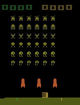

# A3C
The A3C algorithm implemented using Pytorch and heavily inspired by the implementation found at [ikostrikov's repo](https://github.com/ikostrikov/pytorch-a3c).

Built for a Reinforcement Learning course at Oxford University.

  

### TODO:
* Implement command line arguments
* Implement resume training feature
* Make training processes exit upon convergence
* Make testing process exit when training process exits
* Implement logging (tensorboard/visdom)
